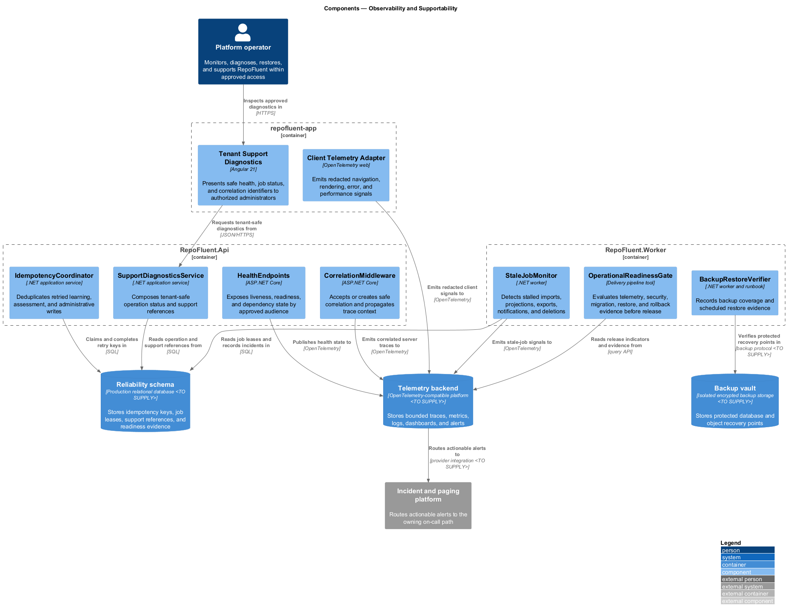
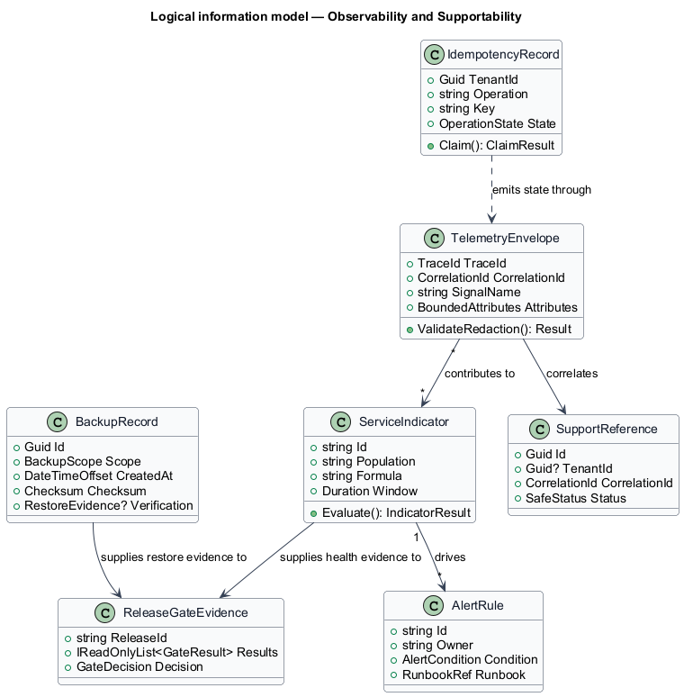
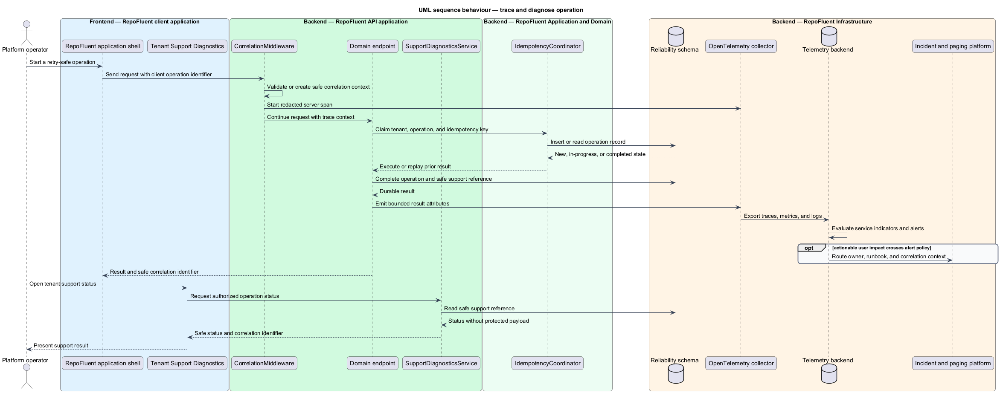

# Observability and Supportability

## Overview

The Observability and Supportability subsystem provides correlated telemetry, monitoring, safe diagnostics, reliability controls, backup evidence, incident practice, and production release gates. It occupies the
`12-observability-supportability` bounded context defined by the subsystem requirements.

The subsystem owns telemetry conventions, correlation, health, service indicators, alerts, support diagnostics, stale-job detection, idempotency infrastructure, backup and restore evidence, incident procedures, and operational release gates. Domain modules remain responsible for correct business events and safe failure behavior.

The subsystem uses these local terms:

- **correlation context** — safe trace, request, job, and operation identifiers propagated across browser, API, worker, audit, and support activity
- **service indicator** — measured signal with a defined population, source, calculation, owner, and target
- **support diagnostic** — tenant-safe status and correlation evidence that excludes curriculum, source, answer, token, and sensitive free-text payloads

## Description

### Architectural boundary

The subsystem is a logical module in the RepoFluent modular platform. Frontend
components live in the single `repofluent-app` Angular application. Synchronous
commands and queries enter through `RepoFluent.Api`. Long-running or retryable
work runs in `RepoFluent.Worker`. The platform [context, container, subsystem,
and deployment views](../) define the shared runtime around this module.

### Deployable mapping

| Deployment unit | Component | Responsibility | Delivery state |
| --- | --- | --- | --- |
| `repofluent-app` | `Client Telemetry Adapter` | Emits redacted navigation, rendering, error, and performance signals | Target platform |
| `repofluent-app` | `Tenant Support Diagnostics` | Presents safe health, job status, and correlation identifiers to authorized administrators | Target platform |
| `RepoFluent.Api` | `CorrelationMiddleware` | Accepts or creates safe correlation and propagates trace context | Foundation partial |
| `RepoFluent.Api` | `HealthEndpoints` | Exposes liveness, readiness, and dependency state by approved audience | Foundation partial |
| `RepoFluent.Api` | `SupportDiagnosticsService` | Composes tenant-safe operation status and support references | Target platform |
| `RepoFluent.Api` | `IdempotencyCoordinator` | Deduplicates retried learning, assessment, and administrative writes | Target platform |
| `RepoFluent.Worker` | `StaleJobMonitor` | Detects stalled imports, projections, exports, notifications, and deletions | Target platform |
| `RepoFluent.Worker` | `BackupRestoreVerifier` | Records backup coverage and scheduled restore evidence | Target platform |
| `RepoFluent.Worker` | `OperationalReadinessGate` | Evaluates telemetry, security, migration, restore, and rollback evidence before release | Target platform |

### Information ownership

| Record group | Authoritative or derived store | Purpose |
| --- | --- | --- |
| Operational telemetry | `Telemetry backend` | Stores bounded traces, metrics, logs, dashboards, and alerts |
| Reliability state | `Reliability schema` | Stores idempotency keys, job leases, support references, and readiness evidence |
| Recovery data | `Backup vault` | Stores protected database and object recovery points |

- Domain stores remain authoritative for business state; the reliability schema owns idempotency, lease, and operational-evidence records.
- Telemetry uses bounded-cardinality identifiers and excludes protected content by default.
- Backup copies retain source classification, encryption, retention, access control, and deletion behavior.

### Collaborations

- Every executable emits the shared correlation and telemetry envelope.
- Security defines redaction, operational access, encryption, audit, and incident constraints.
- Administration exposes a tenant-safe subset of diagnostics; platform operators use the restricted operational backend.

### Decisions and delivery status

- Telemetry, alerting, paging, backup providers, SLOs, RPO, RTO, and deployment topology — `<TO SUPPLY>`.
- Production releases use explicit schema migration, health verification, rollback criteria, and restore evidence.
- Telemetry failure never weakens domain authorization, validation, grading, or data-protection decisions.

The API exposes a basic health endpoint and correlation response header. Integration and E2E tests provide retry and workflow evidence. Structured OpenTelemetry, idempotency records, stale-job monitoring, support diagnostics, backup verification, and operational release gates remain target architecture.

## Diagrams

### Component view

The platform context and container views apply to every subsystem and are not
repeated here. This component view shows the subsystem parts, their deployment
homes, owned stores, and external collaborators.

### Information model

The information model names the durable records and value relationships owned or
consumed by the subsystem. Storage-provider details remain outside this logical
view.

### Primary behaviour — trace and diagnose operation

The sequence shows the principal subsystem behaviour across the frontend,
API, application/domain, and infrastructure boundaries. Alternate paths appear
where they change security, persistence, or user-visible outcomes.

