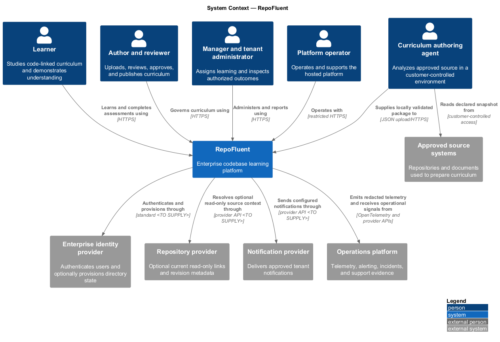
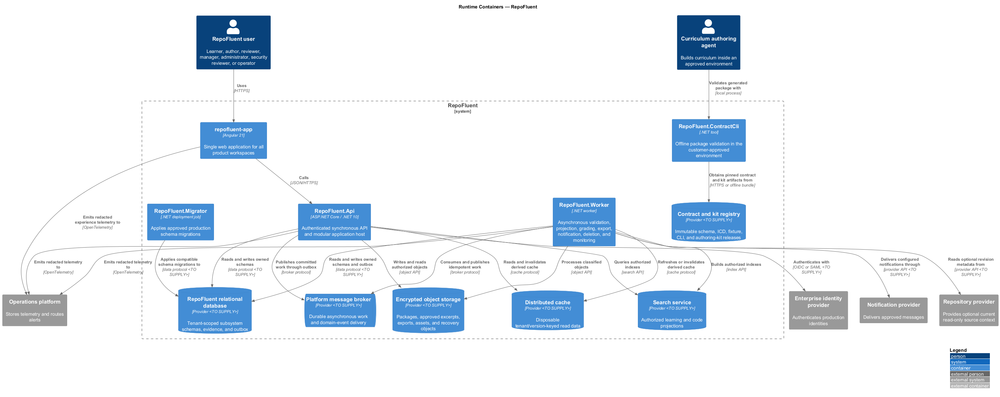
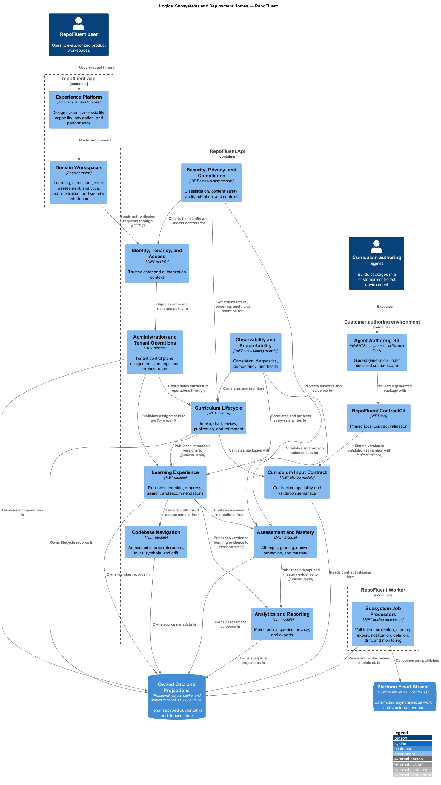
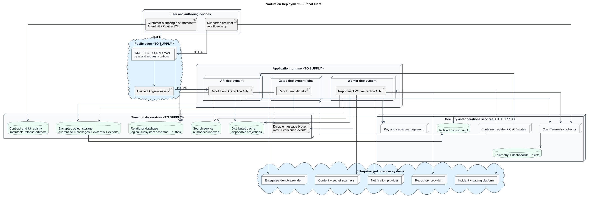
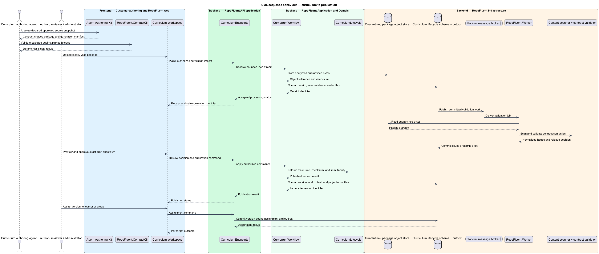
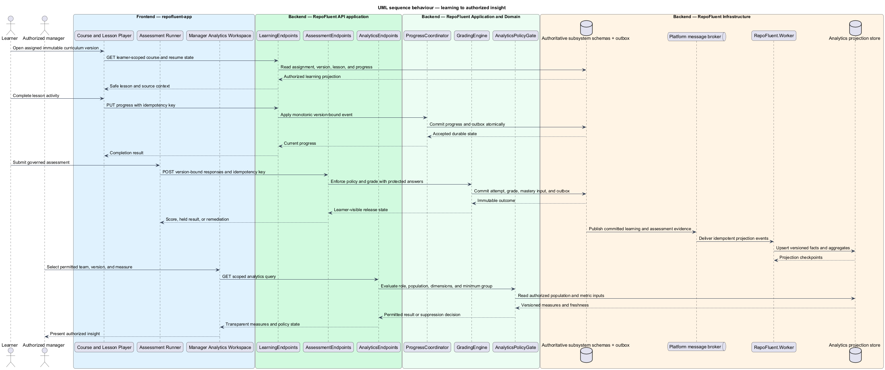

# RepoFluent platform high-level design

## Overview

RepoFluent is an enterprise codebase learning platform. It accepts portable
curriculum packages prepared from approved code and documentation, governs their
publication, delivers source-linked learning, records demonstrated understanding,
and presents authorized measures to learners and managers.

The platform uses a modular architecture with five executable roles. One Angular
web application serves learner, author, reviewer, manager, administrator, and
security workspaces. One ASP.NET Core API exposes synchronous capabilities. One
.NET worker processes asynchronous jobs. One local .NET tool validates curriculum
inside the customer's approved environment. One migration job applies production
database changes before application rollout.

- **modular platform** — deployable set with bounded subsystem modules, explicit
data ownership, and in-process collaboration inside each executable

- **published version** — immutable curriculum snapshot that remains the reference
for assignments, progress, attempts, mastery, and analytics evidence

- **platform event** — versioned tenant-scoped fact written with domain state and
delivered asynchronously through an outbox and durable broker

The design describes the target production architecture and identifies the
foundation already present in the repository. Provider, hosting, scale, and
policy decisions that lack an approved source remain marked `<TO SUPPLY>`.

## Description

### Architecture form

RepoFluent starts as a modular monolith with an independently scalable worker.
The architecture keeps the twelve requirement subsystems as bounded modules in
the web, API, application, domain, infrastructure, and worker codebases. Modules
call public application contracts in process for synchronous work. Modules use
transactional outbox events for long-running work and cross-module projections.

This form keeps the first production system operable while preserving extraction
boundaries. A module may become a separate service only after measured scaling,
availability, security, ownership, or release constraints justify the additional
network and operational boundary.

The accepted [foundational architecture ADR](../adr/0001-foundational-application-architecture.md)
establishes the layered .NET and Angular foundation. The
[development authentication ADR](../adr/0002-development-persona-authentication.md)
limits persona authentication to non-production environments. A production
hosting, database, identity, messaging, and storage decision requires additional
ADRs before deployment.

### Runtime executables and web applications

| Deployment artifact | Type | Responsibility | Current delivery state |
| --- | --- | --- | --- |
| `repofluent-app` | Angular 21 single-page web application | Hosts learner, curriculum, code, assessment, analytics, administration, security, and support workspaces | Application shell and golden-path workspaces exist |
| `RepoFluent.Api` | ASP.NET Core web API | Terminates authenticated API requests and runs synchronous subsystem application logic | Golden-path API exists on .NET 10 |
| `RepoFluent.Worker` | .NET worker process | Consumes validation, projection, grading, export, notification, deletion, drift, and monitoring jobs | Target executable; validation currently runs as an API hosted service |
| `RepoFluent.ContractCli` | Local .NET tool | Validates packages against pinned contract releases without sending customer material to RepoFluent | Target executable |
| `RepoFluent.Migrator` | One-shot .NET deployment job | Applies approved schema migrations before compatible API and worker rollout | Target executable; Development and E2E currently migrate during API startup |

The Angular `api` and `components` projects are libraries consumed by
`repofluent-app`; they are not independent web applications. The agent guidance,
JSON Schema, ICD, fixtures, prompts, and skills are versioned artifacts rather
than hosted executables.

### Source and delivery structure

| Repository area | Architectural role |
| --- | --- |
| `frontend/projects/repofluent-app` | Web application and route-level subsystem workspaces |
| `frontend/projects/api` | Typed API clients, DTOs, authentication/session integration, and request correlation |
| `frontend/projects/components` | Shared semantic renderers and design-system components |
| `backend/src/RepoFluent.Api` | HTTP host, authentication, authorization, middleware, endpoints, and composition root |
| `backend/src/RepoFluent.Application` | Use cases, module contracts, actor context, commands, queries, and ports |
| `backend/src/RepoFluent.Domain` | State transitions, invariants, policies, and domain events |
| `backend/src/RepoFluent.Infrastructure` | Persistence, messaging, object storage, search, identity, scanning, and provider adapters |
| `backend/src/RepoFluent.Worker` | Target background host using the same application and infrastructure modules |
| `backend/src/RepoFluent.ContractCli` | Target offline contract-validation host |
| `backend/src/RepoFluent.Migrator` | Target production schema-migration host |
| `contracts/curriculum` | Versioned curriculum schema, ICD notes, fixtures, and release metadata |
| `docs/specs` | L1 and L2 product requirement baseline by subsystem |

### Production infrastructure inventory

| Infrastructure capability | Purpose | Production selection |
| --- | --- | --- |
| DNS, TLS, CDN, web application firewall, and rate controls | Protect and accelerate the public web and API entry point | `<TO SUPPLY>` |
| Static web asset origin | Store immutable hashed Angular releases and approved public assets | `<TO SUPPLY>` |
| Container registry and orchestrator | Run versioned API and worker images with health, rollout, and scaling policy | `<TO SUPPLY>` |
| Relational database | Hold tenant-scoped transactional state, outbox events, and logical subsystem schemas | `<TO SUPPLY>`; SQLite remains local/test only |
| Encrypted object storage | Hold quarantined packages, published assets, minimized excerpts, exports, and backups | `<TO SUPPLY>` |
| Durable message broker | Decouple committed domain work from worker processing | `<TO SUPPLY>` |
| Distributed cache | Hold disposable tenant/version-keyed read projections and rate state | `<TO SUPPLY>` |
| Search service | Index permitted published learning and code metadata | `<TO SUPPLY>` |
| Enterprise identity provider | Authenticate production users and optionally provision directory state | `<TO SUPPLY>` |
| Key and secret management | Protect service credentials, data keys, signing keys, and cryptographic operations | `<TO SUPPLY>` |
| Content and secret scanning | Classify inert uploads before draft import or rendering | `<TO SUPPLY>` |
| OpenTelemetry collector and operations backend | Collect redacted traces, metrics, logs, dashboards, alerts, and service indicators | `<TO SUPPLY>` |
| Notification provider | Deliver approved assignment, due-date, publication, and failure notifications | `<TO SUPPLY>` |
| Backup vault | Retain encrypted isolated recovery points and restore evidence | `<TO SUPPLY>` |
| CI/CD and policy gates | Build, test, scan, sign, migrate, deploy, verify, and roll back releases | `<TO SUPPLY>` |

### Subsystem map

| Subsystem | Platform responsibility | Primary runtime placement |
| --- | --- | --- |
| [Identity, Tenancy, and Access](01-identity-tenancy-access/) | Tenant identity, authentication, authorization, groups, sessions, and identity audit | Web, API, worker, relational store, identity provider |
| [Curriculum Input Contract](02-curriculum-input-contract/) | Schema, ICD, fixtures, validation vocabulary, compatibility, and contract registry | Contract CLI, shared library, API registry, artifact storage |
| [Agent Authoring Kit](03-agent-authoring-kit/) | Agent guidance, prompts, skills, ecosystem rules, local validation, and generation manifest | Customer authoring environment, Contract CLI, artifact storage |
| [Curriculum Lifecycle](04-curriculum-lifecycle/) | Upload, scan, validation, draft, preview, review, publication, versioning, and retirement | Web, API, worker, relational/object stores, broker |
| [Learning Experience](05-learning-experience/) | Learning home, course delivery, progress, search, glossary, recommendations, and private artifacts | Web, API, worker, relational/search/cache stores |
| [Codebase Navigation](06-codebase-navigation/) | Excerpts, references, tours, source drift, symbols, and architecture relationships | Web, API, worker, relational/object/search stores |
| [Assessment and Mastery](07-assessment-mastery/) | Governed attempts, responses, grading, answer protection, coverage, and mastery | Web, API, worker, relational/protected stores |
| [Analytics and Reporting](08-analytics-reporting/) | Versioned projections, privacy-safe measures, gaps, comparisons, and exports | Web, API, worker, analytical/object stores |
| [Administration and Tenant Operations](09-administration-operations/) | Tenant control plane, assignments, settings, status, retention, branding, and notifications | Web, API, worker, relational store, notification provider |
| [Experience Platform](10-experience-platform/) | Design system, shell, accessibility, responsive behavior, WebGPU fallback, and performance | Web, CDN, browser, API configuration |
| [Security, Privacy, and Compliance](11-security-privacy-compliance/) | Classification, safe intake, encryption, audit, retention policy, and readiness controls | Every executable, worker controls, key/scanning/audit infrastructure |
| [Observability and Supportability](12-observability-supportability/) | Correlation, telemetry, diagnostics, reliability, backup, incidents, and release gates | Every executable, worker monitors, telemetry and backup infrastructure |

### Data ownership and consistency

The production relational database may use one physical cluster, but each
subsystem owns a logical schema and migration boundary. One module does not write
another module's tables. Synchronous application contracts serve consistency
checks that fit one request. Versioned events and projections serve asynchronous
cross-module views.

State-changing operations commit domain state, audit intent, and outbox records
in one local transaction. `RepoFluent.Worker` publishes and consumes those events
with tenant, source record, event version, correlation, and idempotency keys.
Consumers tolerate duplicate and out-of-order delivery. Search, cache, and
analytics remain rebuildable from authoritative state and versioned evidence.

Published curriculum versions, submitted assessment attempts, grades, and audit
events are append-oriented evidence. Corrections add a new version, invalidation,
or compensating record instead of rewriting history.

### Trust boundaries and data flow

The browser, customer authoring environment, uploaded package, repository
provider, identity provider, and notification provider are separate trust
boundaries. The edge enforces transport and coarse request controls. The API
derives tenant and actor context on the server and applies resource policy before
reading protected state. Workers repeat authorization and classification checks
that remain relevant at execution time.

Uploaded content enters encrypted quarantine as inert bytes. Scan and contract
validation complete before draft import. Renderers accept typed safe content and
never execute package scripts, binaries, macros, or arbitrary active HTML.
Protected answers use a logically separated access path. Logs, traces, errors,
support views, and exports exclude protected payloads by default.

### Availability, scale, and release behavior

The web release uses immutable hashed assets. API replicas remain stateless apart
from external session and data services. Worker replicas scale by queue and job
class. Each job type uses explicit lease, idempotency, retry, poison-message, and
staleness policy. Provider-specific replica counts and scale limits remain
`<TO SUPPLY>`.

The production release order is compatible database expansion, application
deployment, health verification, traffic shift, and deferred contract cleanup.
`RepoFluent.Migrator` runs as an explicit gated job. The delivery pipeline records
test, accessibility, security, dependency, migration, rollback, backup, and
restore evidence before production promotion.

### Current foundation

The repository contains the Angular 21 application, .NET 10 layered backend,
SQLite migrations, development persona authentication, guarded package intake,
idempotent draft conversion, and asynchronous validation hosted inside the API.
Tenant package-version uniqueness converges exact replays and retains retry
attempt evidence on one lifecycle record. Versioned reports bind
contract, validator, package, and issue checksums before warning acknowledgement
and approval. Curriculum contract `0.1.0` and an acceptance-tested
curriculum-to-learning path complete the current foundation. This foundation
does not constitute the production infrastructure shown in the deployment view.

## Diagrams

### System context

RepoFluent connects five human roles and a customer-controlled authoring agent to
enterprise identity, approved source, repository, notification, and operations
systems. Source analysis remains outside the hosted platform for the initial
architecture.

### Runtime containers

The container view names every runtime executable and primary data service. The
single web application calls the API, while durable jobs move to the worker
through committed outbox records and the message broker.

### Logical subsystems

The subsystem view maps all twelve bounded contexts into the web, API, worker,
and local authoring executables. Cross-cutting security and observability apply
to every boundary.

### Production deployment

The deployment view separates the public edge, application runtime, data
services, management services, and external enterprise providers. Product and
cloud provider selections remain open where the diagram shows `<TO SUPPLY>`.

### Behaviour — curriculum to publication

The content path begins with local agent generation and validation. Hosted intake
uses quarantine, asynchronous validation, human review, immutable publication,
and assignment before learner visibility.

### Behaviour — learning to insight

The learning path reads an immutable version, records idempotent progress and
assessment evidence, projects analytics asynchronously, and applies manager scope
and privacy policy before presentation.

